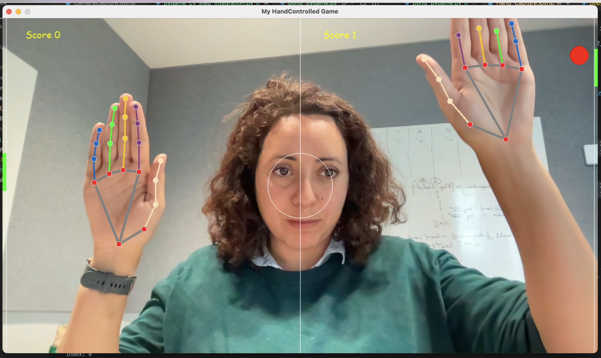
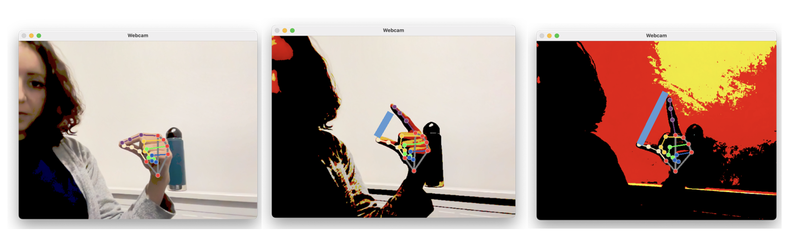
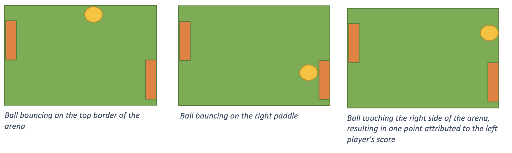

# Vision for HCI Workshop

Week 9 - Designing Novel Interactions (University of Melbourne)

## Description

In this session, you will learn how to use machine vision to make new controls for a game.
This worksheet will guide you through the different steps to make a basic hand gesture controller. But you are free to spice up things and explore other types of interactions.

Figure 1| Screenshot of the pong game in which the green paddles are controlled by the hands. In this example, we use the y coordinate of the index's root (Metacarpi - MCP) joint position to set the y-position of the paddles.

## Objectives

- To understand the concept of particle systems and implement it
- To integrate a gesture/object recognition system into a game as a controller 

## Preliminary steps

To complete this workshop, you will need a computer with a webcam. You will also need to know Python and have installed mediapipe as well as pygame. 

## Part 1 - Getting Familiar with OpenCV and MediaPipe

The first part is to get familiar with OpenCV and mediapipe.
In this part, you will learn how to read and display images and use mediapipe to detect hands on the images.

## Part 2 - Simple Hand Controller using Mediapipe

In this part, to get familiar with the hand information, you will implement a small program that will read the hands information and control the threshold filter of the image.(see https://docs.opencv.org/4.x/d7/d4d/tutorial_py_thresholding.html )

## Part 3 - Pong Game

In this part, we will see how to setup the pong game and how to integrate the hand controller.

